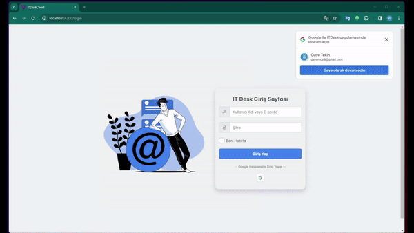

# IT Desk Project

IT Desk Projesi, Angular 17 ve .NET 8 teknolojileri kullanılarak geliştirilmiş bir web uygulamasıdır. Bu proje, kullanıcıların IT destek taleplerini oluşturabilmeleri, bu talepleri listeleme, fotoğraf ekleyebilme ve Google hesapları ile giriş yapabilme gibi özellikleri içermektedir.

## Kullanılan Teknolojiler

- **Frontend İçin Kullanılan Teknolojiler**
  - Angular 17
  - PrimeNG
  - AG Data Grid
  - angularx-social-login

- **Backend İçin Kullanılan Teknolojiler**
  - .NET 8
  - Identity Kütüphanesi
  - JWT (JSON Web Token)
  - FluentValidation

## Proje Detayları

1. **PrimeNG Entegrasyonu:**
   - Kullanıcı ara yüzünü güçlendirmek adına PrimeNG kütüphanesi tercih edildi.

2. **Identity Kütüphanesi ve SignInManager:**
   - Identity kütüphanesi kullanıcı kayıt ve role kontrolü gerçekleştirildi.
   - Kullanıcıların şifresini üç defa yanlış girmesi durumunda hesaplarına 15 dakika boyunca erişim engellemesi için SignInManager kullanıldı.

4. **JWT (JSON Web Token) Kütüphanesi:**
   - Kullanıcı kimlik doğrulaması için JWT kütüphanesi entegre edildi.

5. **FluentValidation Kütüphanesi:**
   - FluentValidation ile form girişlerinde doğrulama kuralları belirlendi. Boş değer bırakılması veya şifrenin özelleştirilmemesi gibi durumlar kontrol edildi.

6. **Google ile Giriş:**
   - Google hesapları ile kayıt olma ve giriş yapma özelliği için angularx-social-login kullanıldı.

7. **Ticket İşlemleri:**
   - Backend tarafında ticket oluşturma ve listeleme işlemleri yapıldı.
   - Kullanıcıların fotoğraf yükleyebilmesi için FormData kullanıldı.
   - Oluşturulan ticketler da kullanıcılar ile admin kullanıcısı arasında karşılıklı mesaj gönderme işlemi gerçekleştirildi.
   - Generic yapıda Http Service ve Error Service oluşturularak esnek veri erişimi ve hata yönetimi sağlandı.

8. **AG Data Grid:**
   - AG Data Grid kullanılarak kullanıcılardan gelen ticketlar listelendi.

## Proje Görseli

